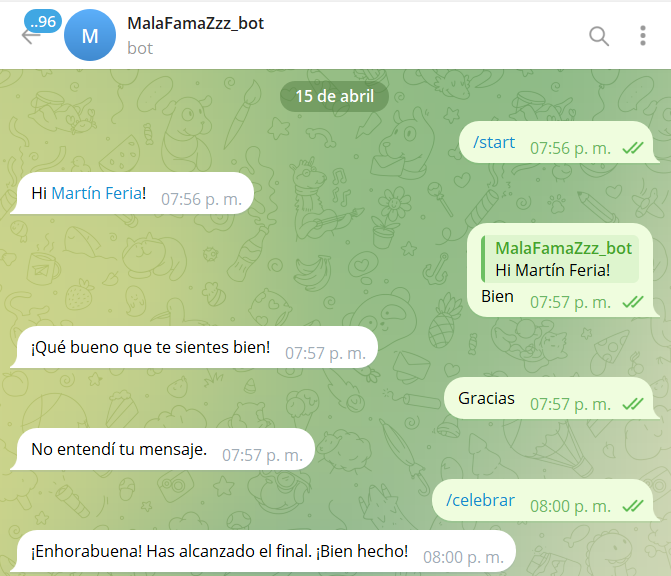

### Creación de un bot de Telegram en Python

#### Paso 1: Configuración inicial

1. Instala Python en tu sistema si aún no lo has hecho.
2. Instala la librería `python-telegram-bot` utilizando pip: `pip install python-telegram-bot`.
3. Crea una cuenta en Telegram si aún no la tienes.
4. Busca el bot llamado BotFather en Telegram y sigue las instrucciones para crear un nuevo bot. Guarda el token que te proporciona BotFather.

#### Paso 2: Escribe el código del bot

#### Paso 3: Ejecuta el bot

1. Reemplaza `'TU_TOKEN'` con el token que recibiste de BotFather.
2. Ejecuta el script de Python.

Este código es un ejemplo de un bot de Telegram escrito en Python utilizando la librería `python-telegram-bot`. Aquí hay una explicación paso a paso y cómo se utiliza la expresión regular en el código:

---



---

**Explicación del código**

1. **Importaciones**: Se importan los módulos y clases necesarios. Entre ellos, `logging`, `re` para expresiones regulares, `random` para generación de números aleatorios, y clases específicas de la librería `python-telegram-bot` como `Update`, `Application`, `CommandHandler`, `MessageHandler`, `filters`, y `ContextTypes`.

2. **Definición de frases**: Se define una lista de diccionarios llamada `frases`, donde cada diccionario contiene información sobre una frase, incluyendo autor y manga.

3. **Definición de funciones de manejo de comandos**:
   - `start`: Envia un mensaje de bienvenida cuando se emite el comando `/start`.
   - `help_command`: Envia un mensaje con información de ayuda cuando se emite el comando `/help`.
   - `echo`: Envía una frase si el mensaje del usuario coincide con una palabra clave.

4. **Función principal `main`**:
   - Se inicializa una aplicación de bot con el token proporcionado.
   - Se agregan los manejadores de comandos y mensajes.
   - Se inicia el bot en modo de escucha continua (`run_polling`).

5. **Ejecución del bot**: Se verifica si el script se ejecuta directamente (`if __name__ == "__main__":`) y se llama a la función `main()`.

---

---

### Uso de expresiones regulares

- En la función `echo`, se utiliza una expresión regular para buscar coincidencias entre el mensaje del usuario y las frases almacenadas en la lista `frases`. La expresión regular se aplica para realizar una búsqueda de palabras clave en el texto del mensaje del usuario. Sin embargo, en este código, no se ha utilizado correctamente la expresión regular.
---

---
Para que la expresión regular funcione correctamente, debe reemplazarse esta línea:
```python
if frase['frase'].lower().find(message_text) != -1:
```
con:
```python
if re.search(r'\b' + re.escape(message_text) + r'\b', frase['frase'].lower()):
```

Esta expresión regular busca coincidencias de palabras completas (no parciales) en el texto de la frase, ignorando mayúsculas y minúsculas.

Para finalizar si no esta en la Base de Datos entonces manda una alerta
---

---
